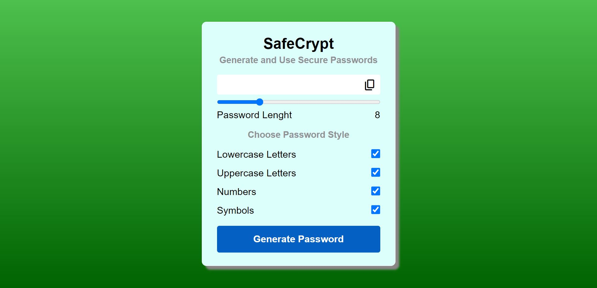

# SafeCrypt

https://alihaydarsucu.github.io/SafeCrypt.github.io/

SafeCrypt , as the name suggests, is a password generator application that allows you to create passwords quickly and easily. 

## Features:

- Choosing a password Length between 4 and 20.
- Desiding to include or exclude;
  - Lowercase Letters,
  - Uppercase Letters,
  - Numbers,
  - Symbols.

## General Look

## Technologies Used

**HTML ,CSS , and JavaScript**

